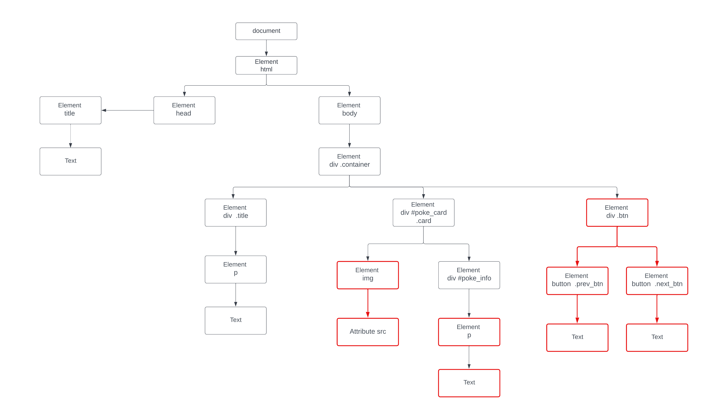
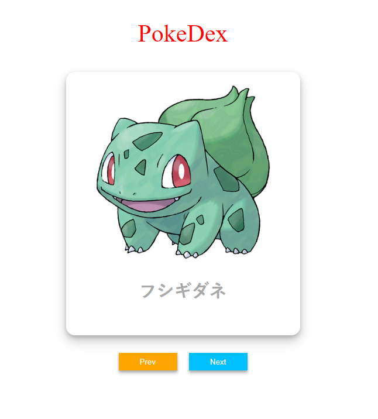

# **PokeDex**

ให้ทำการสร้างเว็บไซต์ PokeDex ตาม Tree diagram ด้านล่างที่เป็นสีแดง

ตัวอย่างผลลัพธ์

เมื่อทำการกดที่ปุ่ม Next จะต้องทำการเปลี่ยนรูปและชื่อของโปรเกม่อนเป็นตัวต่อไปและถ้ากดที่ Prev จะต้องเปลี่ยนรูปและชื่อของโปรเกม่อนเป็นตัวเป็นตัวก่อนหน้า
และถ้าเป็นโปรเกม่อนตัวสุดท้ายเมื่อกด Next จะต้องกลับมาเป็นโปรเกม่อนตัวแรกและถ้ากด Prev โปรเกม่อนตัวแรกจะต้องไปเป็นโปรเกม่อนตัวสุดท้าย

โดยจะต้องใช้ addEventListener เมื่อทำการกดปุ่ม
